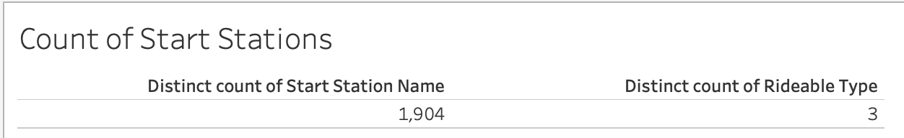
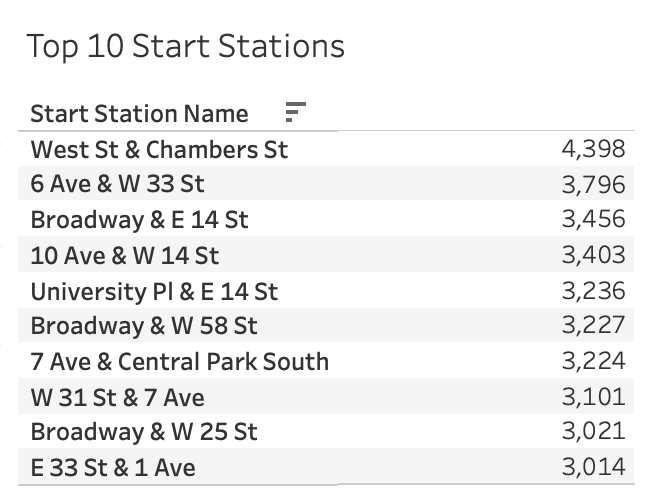
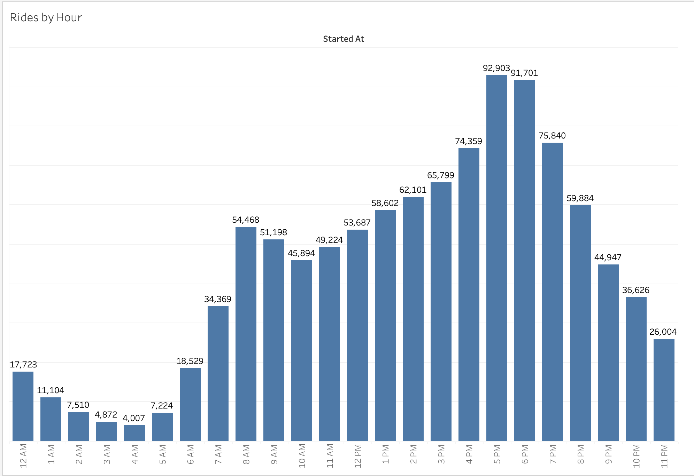
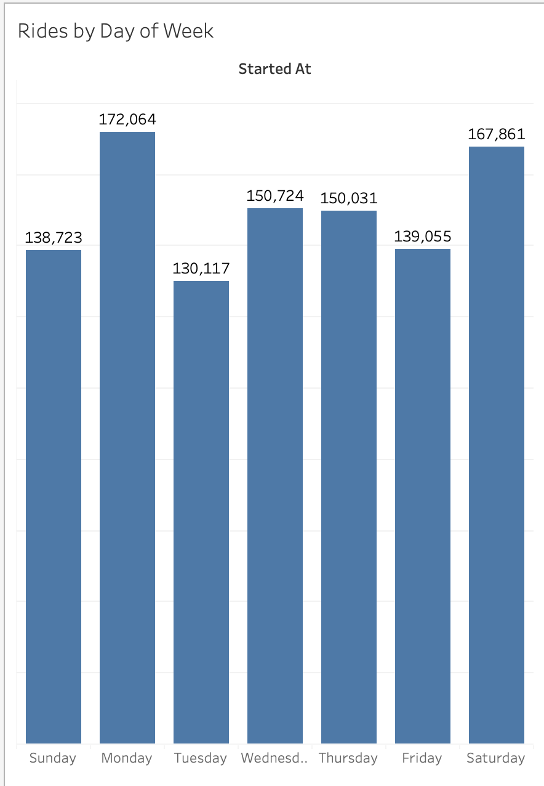
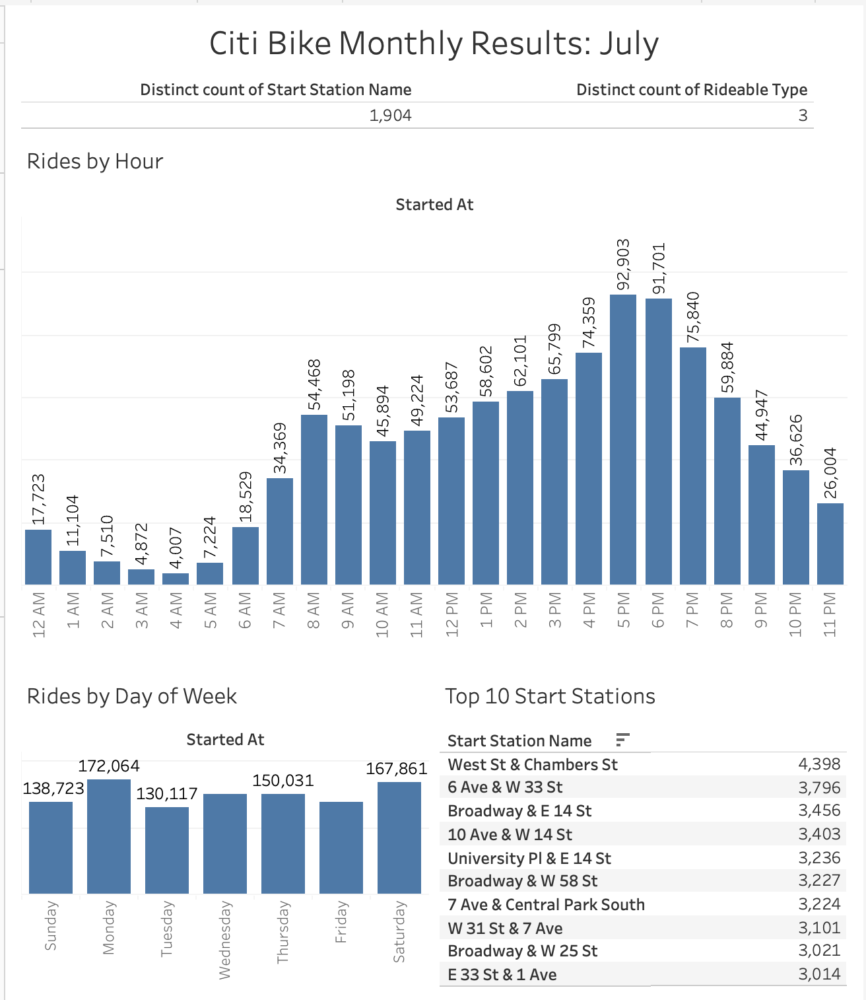
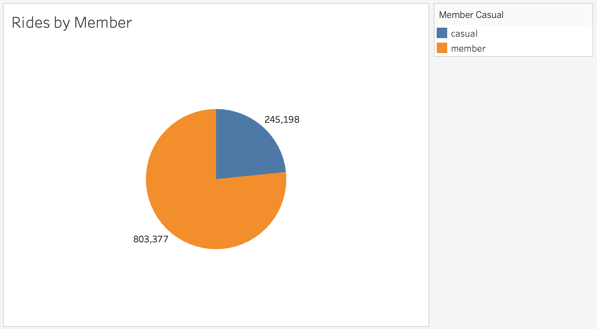
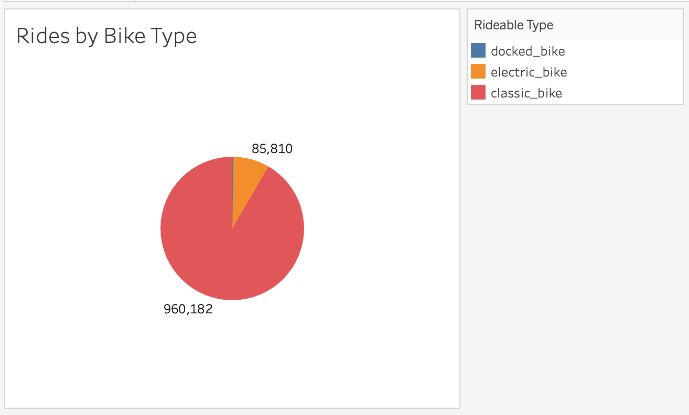
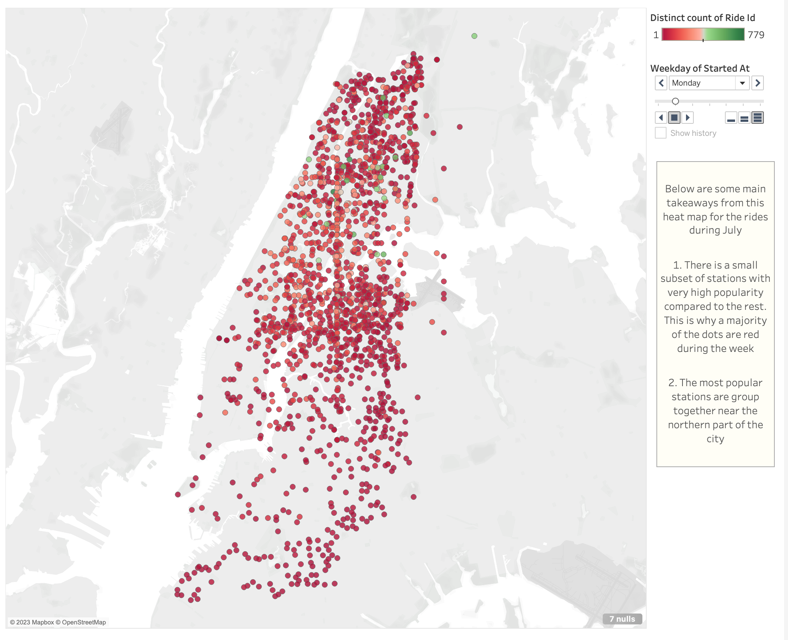

# Citi Bike Analysis

Tablueau Workbook Link: https://public.tableau.com/views/Module18Challenge_16945711048150/CitiBikeDashboard1?:language=en-US&publish=yes&:display_count=n&:origin=viz_share_link

### Phenomena #1: How many unique start stations where there in July of 2023, which one was the most popular start station?

### Phenomena #2: What are the peak hours when bikes are used during July of 2023?

Dashboard 1 is showing a monthly recap of the Citi Bike results from July. For July there were 1,904 unique start stations. The most popular time of the day for a bike ride to start was between 5-7pm. Based on these results it can be inferred it is most common for New Yorkers to use the Citi Bikes to commute home from work.

The most popular day of the week to ride Citi bikes is a Monday. There were 172,064 rides on Mondays during July. Saturday was the 2nd most common day of the week.  

The most popular start station in July was West St & Chambers St. That station was the only one with more than 4,000 rides. 

### Phenomena #3: What is the most popular day of the week during July?

### Dashboard #1 Citi Bike Monthly Results: July

Dashboard 1 is showing a monthly recap of the Citi Bike results from July. For July there were 1,904 unique start stations. The most popular time of the day for a bike ride to start was between 5-7pm. Based on these results it can be inferred it is most common for New Yorkers to use the Citi Bikes to commute home from work.

The most popular day of the week to ride Citi bikes is a Monday. There were 172,064 rides on Mondays during July. Saturday was the 2nd most common day of the week.  

The most popular start station in July was West St & Chambers St. That station was the only one with more than 4,000 rides. 

### Phenomena #4: What proportion of the rides in July of 2023 were members?

### Phenomena #5: What proportion of the rides in July of 2023 were classic bikes?

### Dashboard #2 Type of July Rides

Dashboard 2 is showing a summary on the different ride types. The first pie chart shares a breakdown on rides by member. Based on the results ~75% of the Citi Bike riders in July are members. 

The 2nd pie chart shares a breakdown on rides by type. ~90% of the rides in July were on a classic bike.

Based on these results if you were in New York during July and saw a rider on a Citi bike it would be most likely that you saw a member on a classic bike.

### Map of July 2023 Rides

Below are some main takeaways from this heat map for the rides during July

1. There is a small subset of stations with very high popularity compared to the rest. This is why a majority of the dots are red during the week

2. The most popular stations are group together near the northern part of the city